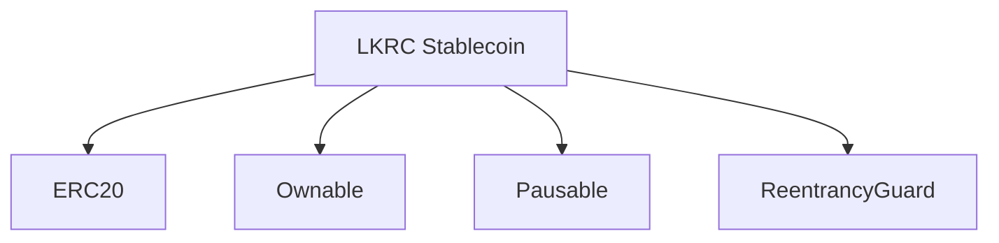
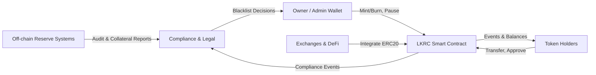

# Contract Components

LKRC Stablecoin leverages OpenZeppelin libraries to combine ERC20 functionality with operational controls.

## Inheritance Overview



- **ERC20** provides standard token interfaces and events.
- **Ownable** restricts administrative operations to the owner.
- **Pausable** introduces an emergency stop for transfers and approvals.
- **ReentrancyGuard** protects state-changing functions from reentrancy attacks.

## Context Diagram



## Core Interface

```solidity
constructor(uint256 _initialSupply, address initialOwner)
```
- `_initialSupply`: Initial token supply (in whole tokens, converted to wei internally).
- `initialOwner`: Address that will own the contract and receive the initial supply.

### Token Operations

```solidity
function transfer(address to, uint256 amount) public returns (bool)
function transferFrom(address from, address to, uint256 amount) public returns (bool)
function approve(address spender, uint256 amount) public returns (bool)
```

### Administrative Functions

```solidity
function mint(address to, uint256 amount) public onlyOwner
function burn(uint256 amount) public onlyOwner
function pause() public onlyOwner
function unpause() public onlyOwner
```

### Blacklist Management

```solidity
function addToBlacklist(address account) public onlyOwner
function removeFromBlacklist(address account) public onlyOwner
function addToBlacklistBatch(address[] calldata accounts) public onlyOwner
function removeFromBlacklistBatch(address[] calldata accounts) public onlyOwner
function isBlacklisted(address account) public view returns (bool)
function destroyBlackFunds(address blackListedUser) public onlyOwner
```

## Design Considerations

- Batch blacklist operations provide gas-efficient compliance enforcement.
- Access control is centralized via the owner address; consider multi-signature wallets for production deployment.
- Reentrancy protection adds a minor gas overhead in exchange for hardened state transitions.
