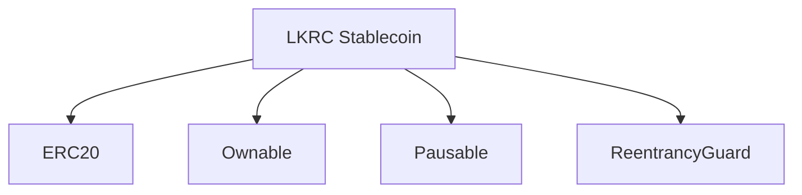
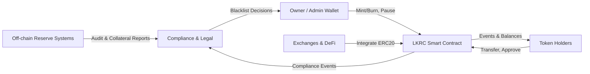

# Contract Components

LKRC Stablecoin leverages OpenZeppelin libraries to combine ERC20 functionality with operational controls.

## Inheritance Overview



- **ERC20** provides standard token interfaces and events.
- **Ownable** restricts administrative operations to the owner.
- **Pausable** introduces an emergency stop for transfers and approvals.
- **ReentrancyGuard** protects state-changing functions from reentrancy attacks.

## Context Diagram



## Core Interface

```solidity
constructor(uint256 _initialSupply, address initialOwner)
```
- `_initialSupply`: Initial token supply (in whole tokens, converted to wei internally).
- `initialOwner`: Address that will own the contract and receive the initial supply.

### Token Operations

```solidity
function transfer(address to, uint256 amount) public returns (bool)
function transferFrom(address from, address to, uint256 amount) public returns (bool)
function approve(address spender, uint256 amount) public returns (bool)
```

### Administrative Functions

```solidity
function mint(address to, uint256 amount) public onlyOwner
function burn(uint256 amount) public onlyOwner
function pause() public onlyOwner
function unpause() public onlyOwner
```

### Blacklist Management

```solidity
function addToBlacklist(address account) public onlyOwner
function removeFromBlacklist(address account) public onlyOwner
function addToBlacklistBatch(address[] calldata accounts) public onlyOwner
function removeFromBlacklistBatch(address[] calldata accounts) public onlyOwner
function isBlacklisted(address account) public view returns (bool)
function destroyBlackFunds(address blackListedUser) public onlyOwner
```

## Events

The contract emits events for transparency and monitoring purposes. All events are indexed for efficient filtering.

### Core Events

**Transfer**
```solidity
event Transfer(address indexed from, address indexed to, uint256 value)
```
Emitted when tokens are transferred, including minting (from = 0x0) and burning (to = 0x0).
- Used by: `transfer()`, `transferFrom()`, `mint()`, `burn()`, `destroyBlackFunds()`

**Approval**
```solidity
event Approval(address indexed owner, address indexed spender, uint256 value)
```
Emitted when allowance is set via `approve()`.
- Used by: `approve()`, `transferFrom()` (implicit)

### Blacklist Events

**AddedToBlacklist**
```solidity
event AddedToBlacklist(address indexed account)
```
Emitted when an address is added to the blacklist.
- Used by: `addToBlacklist()`, `addToBlacklistBatch()`

**RemovedFromBlacklist**
```solidity
event RemovedFromBlacklist(address indexed account)
```
Emitted when an address is removed from the blacklist.
- Used by: `removeFromBlacklist()`, `removeFromBlacklistBatch()`

**DestroyedBlackFunds**
```solidity
event DestroyedBlackFunds(address indexed blackListedUser, uint256 balance)
```
Emitted when funds from a blacklisted address are destroyed.
- Used by: `destroyBlackFunds()`

### Operational Events

**Paused**
```solidity
event Paused(address account)
```
Emitted when the contract is paused.
- Used by: `pause()`

**Unpaused**
```solidity
event Unpaused(address account)
```
Emitted when the contract is unpaused.
- Used by: `unpause()`

**OwnershipTransferred**
```solidity
event OwnershipTransferred(address indexed previousOwner, address indexed newOwner)
```
Emitted when ownership is transferred.
- Used by: `transferOwnership()`, `renounceOwnership()`, constructor

### Event Monitoring

Events enable:
- Real-time compliance monitoring
- Audit trail for regulatory requirements
- Integration with off-chain systems
- Alert systems for operational teams
- Block explorer transparency

**Example Usage:**
```javascript
// Monitor all transfers
lkrc.on("Transfer", (from, to, amount) => {
  console.log(`${from} -> ${to}: ${amount}`);
});

// Monitor blacklist changes
lkrc.on("AddedToBlacklist", (account) => {
  console.log(`Blacklisted: ${account}`);
});
```

## Design Considerations

- Batch blacklist operations provide gas-efficient compliance enforcement.
- Access control is centralized via the owner address; consider multi-signature wallets for production deployment.
- Reentrancy protection adds a minor gas overhead in exchange for hardened state transitions.
- All state changes emit events for transparency and monitoring.
- Indexed event parameters enable efficient filtering and querying.
