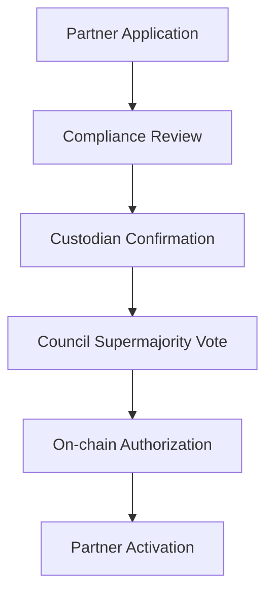
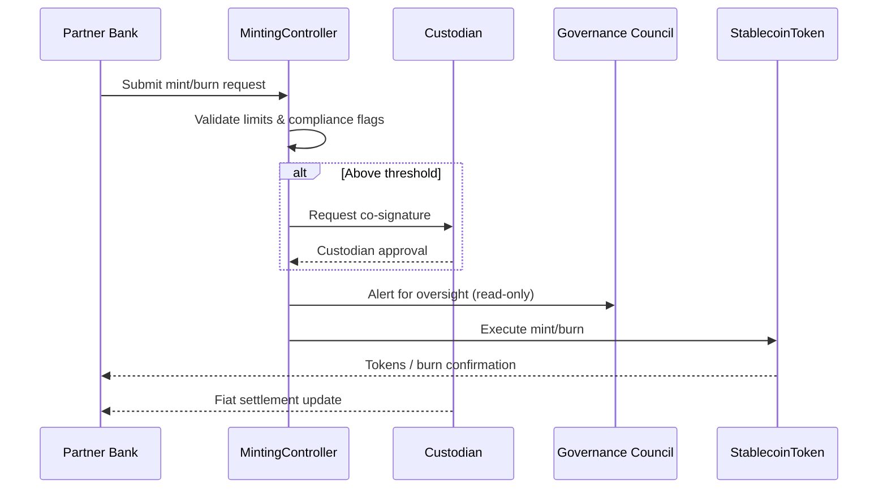
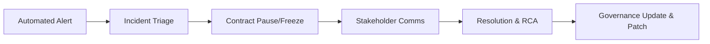
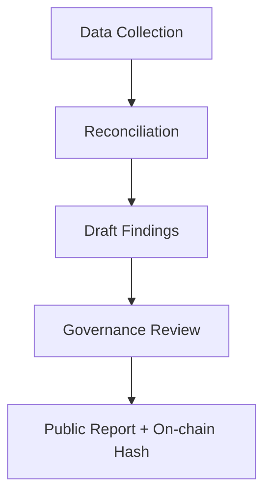

# Governance Processes

This document details operational workflows and the smart-contract controls that enforce them.

## Partner Onboarding Workflow

1. **Application Intake** – Partner submits compliance package through secure portal; metadata stored in `PartnerRegistry` contract.
2. **Due Diligence Review** – Governance Council compliance subcommittee evaluates KYC/AML documentation; status tracked via `PartnerRegistry.setStatus()`.
3. **Custodian Alignment** – Custodians confirm reserve account readiness and link to `ReserveVault` contract.
4. **Governance Vote** – Governance Council proposes and executes an onboarding transaction requiring ≥ 67% multi-sig approval in `GovernanceCouncil.executeOnboarding()`.
5. **Activation Notice** – Partner bank receives activation via messaging queue; `MintingController.authorizePartner()` enables mint/burn requests.

### RACI Overview

| Activity | Governance Council | Partner Banks | Custodians | Auditors |
| --- | --- | --- | --- | --- |
| Collect application data | C | **R** | I | I |
| Perform compliance review | **A/R** | C | I | I |
| Confirm reserve setup | C | C | **R** | I |
| Execute onboarding vote | **A/R** | I | C | I |
| Publish onboarding report | **A** | C | C | **R** |

## Mint/Burn Approval Workflow

1. **Request Submission** – Partner bank submits mint or burn request via API; request hashed into `MintingController` queue.
2. **Automated Limit Check** – Smart contract enforces credit line, velocity caps, and compliance flags before queuing.
3. **Dual Authorization** – For amounts above the daily threshold, custodian co-signature required using `MintingController.confirmByCustodian()`.
4. **Governance Oversight** – Governance Council monitors aggregated activity through `TreasuryMonitor` contract alerts; council approval required for exceptional overrides.
5. **Execution & Settlement** – Upon required signatures, `StablecoinToken.mint()` or `.burn()` executes; custodians update fiat ledgers.

## Incident Management Workflow

1. **Detection** – Monitoring agents flag abnormal activity and emit events from `RiskModule` contract.
2. **Triage** – Governance Council incident response team classifies severity via incident playbooks.
3. **Containment** – Custodians invoke `MintingController.pausePartner()` or `ReserveVault.freeze()` as required.
4. **Communication** – Stakeholders updated via incident bridge; public disclosure prepared if severity high.
5. **Resolution & Postmortem** – Root cause analysis documented; smart-contract upgrades or policy changes proposed.

### Incident Response Accountability

| Task | Governance Council | Partner Banks | Custodians | Auditors |
| --- | --- | --- | --- | --- |
| Initiate incident bridge | **R** | I | C | I |
| Classify severity | **A/R** | C | C | I |
| Execute contract pause | **A** | I | **R** | I |
| Communicate externally | **A/R** | C | C | I |
| Verify remediation | **A** | C | C | **R** |

## Audit Reporting Workflow

1. **Data Collection** – Auditors access read-only ledgers via `AuditRegistry` and off-chain bank statements.
2. **Reconciliation** – Custodians and partner banks reconcile balances against `ReserveVault` and `StablecoinToken.totalSupply()`.
3. **Draft Findings** – Audit team prepares report; discrepancies logged in `AuditRegistry.raiseIssue()` requiring council acknowledgement.
4. **Governance Review** – Governance Council reviews findings, proposes remediation via `GovernanceCouncil.proposeAction()`.
5. **Publication** – Final report published to public portal; on-chain hash stored in `AuditRegistry.publishReport()`.

### RACI Summary

| Activity | Governance Council | Partner Banks | Custodians | Auditors |
| --- | --- | --- | --- | --- |
| Provide financial data | C | **R** | **R** | C |
| Perform reconciliation | C | **R** | **R** | C |
| Draft audit report | I | I | I | **A/R** |
| Approve remediation plan | **A/R** | C | C | C |
| Publish final report | **A** | I | I | **R** |

## Communication Protocols

- Incident bridge relies on end-to-end encrypted channels with logging for regulators.
- Governance Council circulates mint/burn summaries weekly via secure bulletin linked to on-chain analytics.
- Auditors deliver signed PDF reports and on-chain hashes to ensure tamper-evident dissemination.
