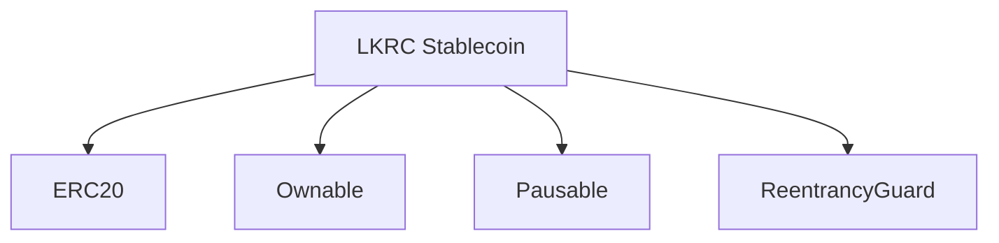

# LKRC Stablecoin Documentation

LKRC Stablecoin is an Ethereum-based ERC20 token that adds operational controls for compliant, enterprise-grade usage. This documentation set helps engineers, operators, and auditors understand how the contract is structured and how to manage it safely.

## Quick Start

New to LKRC? Start here:

1. **[Getting Started](getting-started.md)** - Setup, compilation, testing, and deployment
2. **[Architecture Overview](architecture/contract-components.md)** - Understand the contract structure
3. **[API Reference](reference/api.md)** - Complete function documentation

## Documentation Sections

### For Developers

- **[Getting Started](getting-started.md)** - Installation, compilation, testing, and deployment guide
- **[Architecture: Contract Components](architecture/contract-components.md)** - Smart contract modules, inheritance layout, control flows, and events
- **[API Reference](reference/api.md)** - Complete function reference with parameters, modifiers, events, and gas costs
- **[Error Reference](reference/errors.md)** - Troubleshooting guide with common errors and solutions

### For Operators

- **[Operations: Token Lifecycle](operations/token-lifecycle.md)** - Procedures for minting, burning, pausing, blacklist management, and gas optimization
- **[Compliance: Security Controls](compliance/security-controls.md)** - Governance tooling, enforcement features, attack vectors, and mitigations

### For Integrators

- **[Exchange and dApp Integration](integration/exchanges.md)** - Complete integration guide with code examples, event monitoring, and best practices

### For Auditors

- **[Security Audit Checklist](security/audit-checklist.md)** - Comprehensive security considerations, attack vectors, testing requirements, and audit points

### Use Cases & Personas

- **[Stablecoin Issuer Journey](use-cases/stablecoin-issuer.md)** - Day-to-day operations for entities governing reserves, managing issuance, and enforcing compliance controls
- **[Bank Integration Playbook](use-cases/bank-integration.md)** - How commercial banks provide fiat on/off ramps and settlement services with LKRC
- **[Enterprise Treasury Runbook](use-cases/enterprise-treasury.md)** - Corporate treasury workflows for liquidity management, on-chain payments, and risk mitigation

## Quick Reference

### Contract Information

- **Symbol**: `LKRC`
- **Decimals**: `18`
- **Network**: Ethereum-compatible EVM chains
- **License**: MIT
- **Solidity Version**: ^0.8.19
- **Dependencies**: OpenZeppelin Contracts v5.0.0+

### Key Features

- ✅ ERC20 standard compliance
- ✅ Pausable transfers for emergency response
- ✅ Blacklist enforcement for regulatory compliance
- ✅ Owner-controlled minting and burning
- ✅ Batch operations for gas efficiency
- ✅ Reentrancy protection
- ✅ Battle-tested OpenZeppelin base contracts

### Core Functions

| Category | Functions |
|----------|-----------|
| **Token Operations** | `transfer()`, `transferFrom()`, `approve()`, `balanceOf()` |
| **Minting & Burning** | `mint()`, `burn()` |
| **Pause Control** | `pause()`, `unpause()` |
| **Blacklist** | `addToBlacklist()`, `removeFromBlacklist()`, `addToBlacklistBatch()`, `removeFromBlacklistBatch()`, `destroyBlackFunds()` |
| **Ownership** | `transferOwnership()`, `renounceOwnership()` |

### Important Events

- `Transfer` - Token transfers, mints, and burns
- `Approval` - Allowance changes
- `AddedToBlacklist` / `RemovedFromBlacklist` - Compliance actions
- `DestroyedBlackFunds` - Fund seizures
- `Paused` / `Unpaused` - Emergency controls
- `OwnershipTransferred` - Governance changes

## Common Tasks

### Deploy the Contract
```bash
npm install
npx hardhat compile
npx hardhat run scripts/deploy.js --network sepolia
```
See [Getting Started](getting-started.md) for details.

### Mint Tokens
```javascript
await lkrc.mint(recipientAddress, ethers.parseEther("1000"));
```

### Manage Blacklist
```javascript
// Single address
await lkrc.addToBlacklist(address);

// Multiple addresses (more gas efficient)
await lkrc.addToBlacklistBatch([address1, address2, address3]);
```

### Emergency Pause
```javascript
await lkrc.pause();
// Later, when resolved:
await lkrc.unpause();
```

## Architecture Overview



The contract inherits from four OpenZeppelin contracts:
- **ERC20** - Standard token functionality
- **Ownable** - Access control for admin functions
- **Pausable** - Emergency circuit breaker
- **ReentrancyGuard** - Attack prevention

## Security Considerations

LKRC implements multiple security layers:

1. **Reentrancy Protection** - All state-changing functions use `nonReentrant` modifier
2. **Access Control** - Admin functions restricted to owner via `onlyOwner` modifier
3. **Pause Mechanism** - Emergency stop for all transfers and operations
4. **Blacklist Enforcement** - Compliance checks on all token movements
5. **Battle-Tested Base** - Uses OpenZeppelin contracts with proven security track record

**Recommended for Production:**
- Use multi-signature wallet (3-of-5 or 4-of-7) for owner address
- Implement timelock for critical operations (24-48 hours)
- Set up comprehensive event monitoring
- Complete external security audit before mainnet deployment

See [Security Audit Checklist](security/audit-checklist.md) for comprehensive security review.

## Gas Optimization

LKRC includes gas-efficient batch operations:

| Operation | Gas Cost | Batch Savings |
|-----------|----------|---------------|
| Single blacklist add | ~45,000 gas | - |
| Batch blacklist add (10 addresses) | ~225,000 gas | ~50% savings |
| Single blacklist remove | ~30,000 gas | - |
| Batch blacklist remove (10 addresses) | ~175,000 gas | ~42% savings |

See [Token Lifecycle Operations](operations/token-lifecycle.md) for detailed gas optimization strategies.

## Support and Resources

### Documentation Map

```
docs/
├── index.md (you are here)
├── getting-started.md
├── architecture/
│   └── contract-components.md
├── operations/
│   └── token-lifecycle.md
├── compliance/
│   └── security-controls.md
├── reference/
│   ├── api.md
│   └── errors.md
├── integration/
│   └── exchanges.md
├── security/
│   └── audit-checklist.md
└── use-cases/
    ├── stablecoin-issuer.md
    ├── bank-integration.md
    └── enterprise-treasury.md
```

### External Resources

- **Contract Source**: See `LKRC.sol` in project root
- **OpenZeppelin Docs**: https://docs.openzeppelin.com/contracts/5.x/
- **Ethereum Development**: https://ethereum.org/developers
- **Hardhat Documentation**: https://hardhat.org/docs

### Getting Help

- **Technical Issues**: See [Error Reference](reference/errors.md)
- **Integration Questions**: See [Integration Guide](integration/exchanges.md)
- **Security Concerns**: See [Security Audit Checklist](security/audit-checklist.md)

## Next Steps

1. **Developers**: Start with [Getting Started](getting-started.md) to set up your environment
2. **Operators**: Review [Token Lifecycle Operations](operations/token-lifecycle.md) for operational procedures
3. **Integrators**: Check [Exchange Integration Guide](integration/exchanges.md) for integration patterns
4. **Auditors**: See [Security Audit Checklist](security/audit-checklist.md) for audit points
5. **Persona-Specific Guides**: Explore use cases for [Stablecoin Issuers](use-cases/stablecoin-issuer.md), [Banks](use-cases/bank-integration.md), or [Enterprises](use-cases/enterprise-treasury.md)

---

**Last Updated**: 2025-10-14
**Documentation Version**: 1.0
**Contract Version**: 1.0
