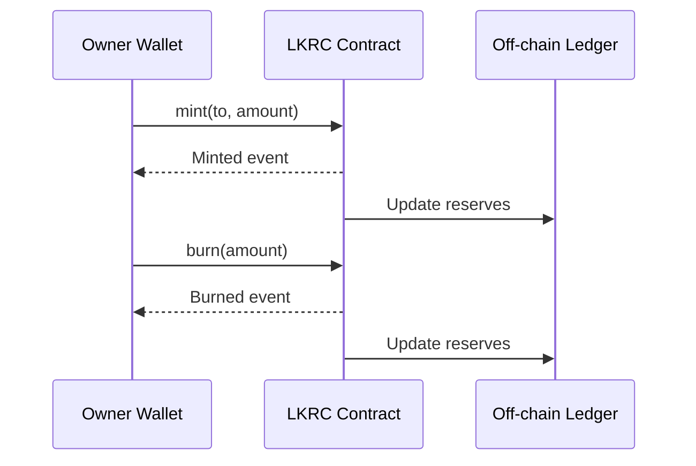

# Token Lifecycle Operations

These procedures describe how administrators and operators manage circulating supply and react to incidents.

## Minting Tokens

1. Confirm the recipient address is not blacklisted.
2. Call `mint(to, amount)` from the owner wallet.
3. Monitor emitted events to verify mint completion.

```solidity
// Mint 1000 tokens to an approved address
mint(userAddress, 1000 * 10**18);
```

## Burning Tokens

1. Ensure the owner wallet holds at least the burn amount.
2. Call `burn(amount)` from the owner wallet.
3. Reconcile supply change with reserve accounting.

```solidity
// Burn 500 tokens from the owner balance
burn(500 * 10**18);
```

## Mint/Burn Sequence



## Emergency Pause

- `pause()` halts transfers, approvals, minting, and burning.
- Resume operations with `unpause()` when the incident is resolved.

## Blacklist Management

- `addToBlacklist(account)` prevents an address from sending, receiving, or approving tokens.
- `removeFromBlacklist(account)` restores normal access once compliance review clears the account.
- Batch operations (`addToBlacklistBatch`, `removeFromBlacklistBatch`) streamline large enforcement actions.
- `destroyBlackFunds(blackListedUser)` removes funds seized from sanctioned addresses.

## Operational Tips

- Establish runbooks for reserve verification before large mints.
- Maintain monitoring for pause and blacklist events to alert stakeholders.
- Log admin wallet activity and enforce multi-signature approval for sensitive calls.
