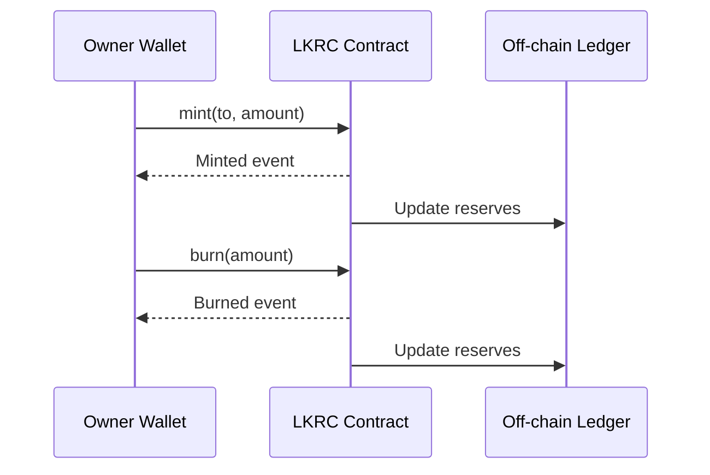

# Token Lifecycle Operations

These procedures describe how administrators and operators manage circulating supply and react to incidents.

## Minting Tokens

1. Confirm the recipient address is not blacklisted.
2. Call `mint(to, amount)` from the owner wallet.
3. Monitor emitted events to verify mint completion.

```solidity
// Mint 1000 tokens to an approved address
mint(userAddress, 1000 * 10**18);
```

## Burning Tokens

1. Ensure the owner wallet holds at least the burn amount.
2. Call `burn(amount)` from the owner wallet.
3. Reconcile supply change with reserve accounting.

```solidity
// Burn 500 tokens from the owner balance
burn(500 * 10**18);
```

## Mint/Burn Sequence



## Emergency Pause

- `pause()` halts transfers, approvals, minting, and burning.
- Resume operations with `unpause()` when the incident is resolved.

## Blacklist Management

- `addToBlacklist(account)` prevents an address from sending, receiving, or approving tokens.
- `removeFromBlacklist(account)` restores normal access once compliance review clears the account.
- Batch operations (`addToBlacklistBatch`, `removeFromBlacklistBatch`) streamline large enforcement actions.
- `destroyBlackFunds(blackListedUser)` removes funds seized from sanctioned addresses.

## Gas Optimization

Understanding gas costs helps optimize operational efficiency and reduce transaction fees.

### Individual Operation Gas Costs

| Operation | Estimated Gas | USD Cost (30 gwei)* | USD Cost (100 gwei)* |
|-----------|--------------|---------------------|----------------------|
| `mint()` | 45,000-60,000 | $1.35-$1.80 | $4.50-$6.00 |
| `burn()` | 30,000-45,000 | $0.90-$1.35 | $3.00-$4.50 |
| `transfer()` | 45,000-60,000 | $1.35-$1.80 | $4.50-$6.00 |
| `transferFrom()` | 50,000-65,000 | $1.50-$1.95 | $5.00-$6.50 |
| `approve()` | 30,000-45,000 | $0.90-$1.35 | $3.00-$4.50 |
| `pause()` | ~30,000 | ~$0.90 | ~$3.00 |
| `unpause()` | ~30,000 | ~$0.90 | ~$3.00 |
| `addToBlacklist()` | ~45,000 | ~$1.35 | ~$4.50 |
| `removeFromBlacklist()` | ~30,000 | ~$0.90 | ~$3.00 |
| `destroyBlackFunds()` | 40,000-50,000 | $1.20-$1.50 | $4.00-$5.00 |

\* Assumes ETH price of $1,000. Adjust proportionally for current ETH price.

### Batch Operations Gas Savings

Batch operations provide significant gas savings when managing multiple addresses:

**addToBlacklistBatch()**
- Base cost: ~25,000 gas
- Per address: ~20,000 gas
- Example: 10 addresses = ~225,000 gas (~$6.75 at 30 gwei)
- Individual operations: 10 × 45,000 = 450,000 gas (~$13.50 at 30 gwei)
- **Savings: ~50% for batch operations**

**removeFromBlacklistBatch()**
- Base cost: ~25,000 gas
- Per address: ~15,000 gas
- Example: 10 addresses = ~175,000 gas (~$5.25 at 30 gwei)
- Individual operations: 10 × 30,000 = 300,000 gas (~$9.00 at 30 gwei)
- **Savings: ~42% for batch operations**

### Gas Optimization Strategies

1. **Use Batch Operations**
   - Always use batch functions when managing multiple addresses
   - Optimal batch size: 50-100 addresses per transaction
   - Larger batches may hit block gas limit (30M gas)

2. **Time Operations Strategically**
   - Monitor gas prices using ETH Gas Station or similar
   - Schedule non-urgent operations during low-traffic periods (weekends, late night UTC)
   - Use EIP-1559 base fee tracking to predict optimal timing

3. **Optimize Transaction Parameters**
   ```javascript
   // Use appropriate gas settings
   const tx = await lkrc.mint(recipient, amount, {
     maxFeePerGas: ethers.parseUnits("50", "gwei"),
     maxPriorityFeePerGas: ethers.parseUnits("2", "gwei")
   });
   ```

4. **Consolidate Operations**
   - Batch multiple mints into fewer, larger transactions when possible
   - Coordinate blacklist updates to minimize separate transactions

5. **Monitor View Functions**
   - View functions are free when called off-chain
   - Use `balanceOf()`, `isBlacklisted()`, `paused()` liberally for pre-checks
   - Only execute state-changing operations after validation

### Gas Cost Examples

**Scenario 1: Mint tokens to 5 users**
```
Option A (Individual):
5 × 50,000 gas = 250,000 gas
At 30 gwei: ~$7.50

Option B (Better approach):
Pre-fund owner wallet, users call transfer: 5 × 50,000 = 250,000 gas
Note: Similar cost, but decentralized

Recommendation: Individual mints from owner wallet
```

**Scenario 2: Blacklist 20 addresses**
```
Option A (Individual):
20 × 45,000 gas = 900,000 gas
At 30 gwei: ~$27.00

Option B (Batch):
25,000 + (20 × 20,000) = 425,000 gas
At 30 gwei: ~$12.75

Savings: ~53% ($14.25 saved)
```

**Scenario 3: Emergency Response**
```
1. Pause contract: 30,000 gas (~$0.90)
2. Blacklist bad actor: 45,000 gas (~$1.35)
3. Destroy funds: 45,000 gas (~$1.35)
4. Unpause contract: 30,000 gas (~$0.90)

Total: 150,000 gas (~$4.50 at 30 gwei)
```

## Operational Tips

- Establish runbooks for reserve verification before large mints.
- Maintain monitoring for pause and blacklist events to alert stakeholders.
- Log admin wallet activity and enforce multi-signature approval for sensitive calls.
- Monitor gas prices and schedule non-urgent operations during low-fee periods.
- Use batch operations whenever managing multiple addresses to reduce costs by ~50%.
- Pre-validate all operations using view functions before executing state changes.
- Track operational costs monthly to optimize budget and procedures.

## Automation Considerations

For high-frequency operations:

1. **Automated Gas Price Monitoring**
   ```javascript
   // Wait for favorable gas prices
   async function waitForGasPrice(maxGwei) {
     const feeData = await provider.getFeeData();
     const currentGwei = Number(feeData.gasPrice) / 1e9;

     if (currentGwei <= maxGwei) {
       return feeData;
     }

     // Wait and retry
     await new Promise(resolve => setTimeout(resolve, 60000));
     return waitForGasPrice(maxGwei);
   }
   ```

2. **Batch Processing Queue**
   - Accumulate blacklist changes throughout the day
   - Execute batch operation once daily during low-gas period
   - Reduces gas costs while maintaining operational efficiency

3. **Emergency Override**
   - Critical operations (pause, time-sensitive blacklists) execute immediately
   - Non-critical operations can wait for optimal gas prices
