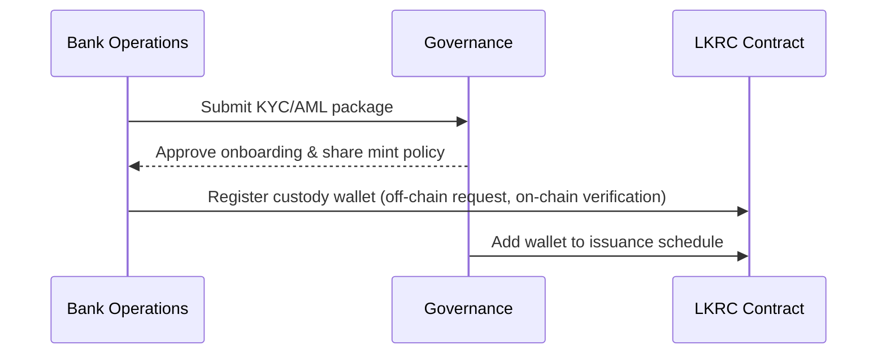
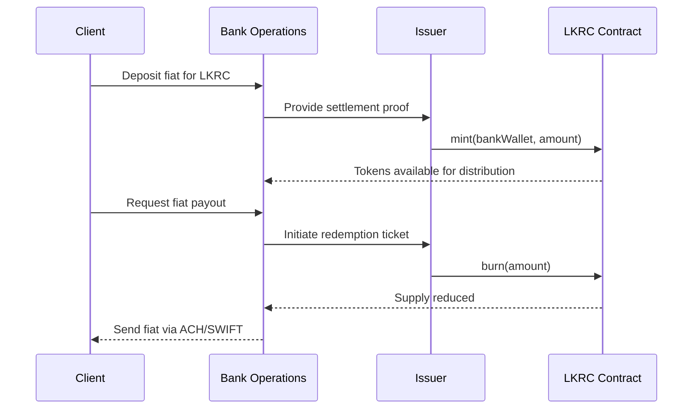
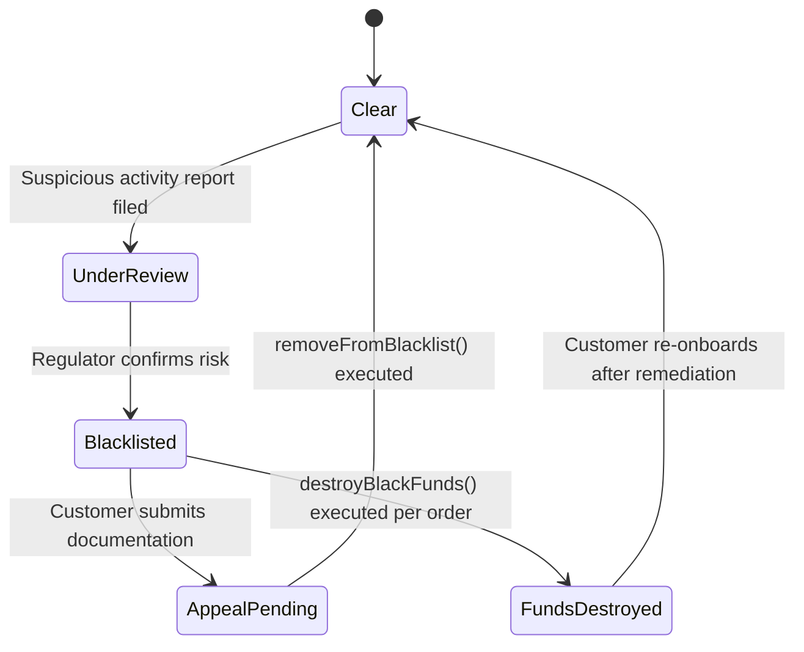
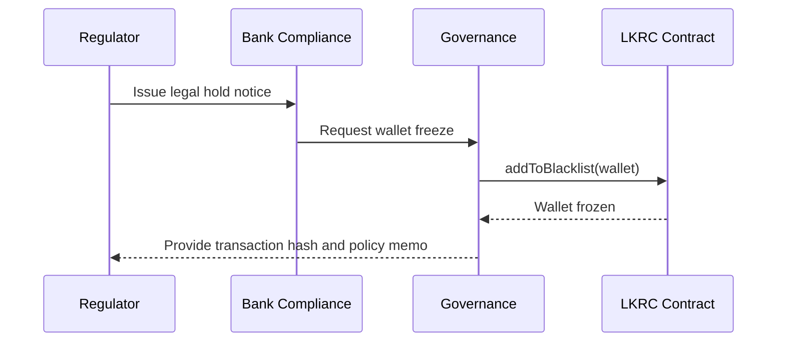

# Bank Integration Playbook

Commercial banks integrate with LKRC to provide fiat on/off ramps and settlement services. This guide highlights how treasury ops, compliance, and settlement tech teams interact with the smart contract.

## Onboarding Workflow

1. **Due diligence** – Bank compliance reviews LKRC governance charter and blacklisting policy to ensure alignment with regulatory expectations.
2. **Connectivity setup** – Treasury tech teams configure custodial wallets and register whitelisted addresses with the issuer to allow [`mint`](../../README.md#core-functions) destinations.
3. **Settlement agreement** – Governance council and bank sign service-level agreements that reference responsibilities for invoking [`burn`](../../README.md#core-functions) during redemptions and procedures for [`destroyBlackFunds`](../../README.md#core-functions) if regulators demand forfeiture.
4. **Contingency runbook** – Joint risk committee rehearses pause scenarios where the issuer might activate [`pause`](../../README.md#core-functions) and how the bank will notify clients.

## Daily Settlement Operations

- **Fiat deposits → LKRC issuance** – Bank ingest fiat wires, reconcile deposits, and notify issuer operations to execute [`mint`](../../README.md#core-functions). The bank updates its core banking ledger to reflect token delivery.
- **Fiat payouts → Token redemption** – When clients request fiat, the bank coordinates with issuer treasury to call [`burn`](../../README.md#core-functions). Bank compliance confirms the requesting address is not blacklisted via [`isBlacklisted`](../../README.md#core-functions).
- **Blacklist synchronization** – Bank monitors regulator lists and informs issuer if a client must be blocked, prompting [`addToBlacklist`](../../README.md#core-functions). Bank updates internal CRM to prevent future transfers.

### Compliance State Machine

## Edge Cases & Governance Touchpoints

- **Payment network outage** – If the bank cannot settle fiat, it coordinates with governance to trigger [`pause`](../../README.md#core-functions) so clients do not receive tokens without banking rails. Governance logs the decision and shares resumption criteria.
- **Regulator freeze** – Upon receiving a legal hold, bank compliance requires issuer to execute [`addToBlacklist`](../../README.md#core-functions) and possibly [`destroyBlackFunds`](../../README.md#core-functions). Governance collects case IDs and references them in their decision ledger.
- **Dispute resolution** – If a client disputes a blacklist action, the bank submits evidence to the governance appeals committee. After review, the committee may call [`removeFromBlacklist`](../../README.md#core-functions) and share an attested resolution letter.

**Governance Alignment:** Banks should maintain a mapping between core banking case numbers and on-chain transaction hashes for audits. Governance meets quarterly with banking partners to review incident metrics and confirm readiness to invoke pause/unpause protocols.
