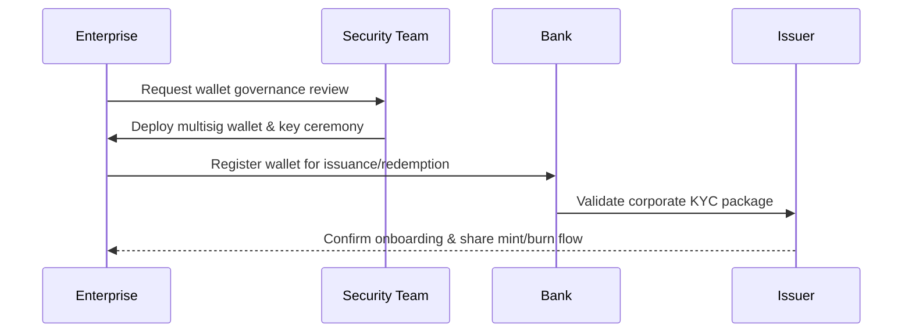
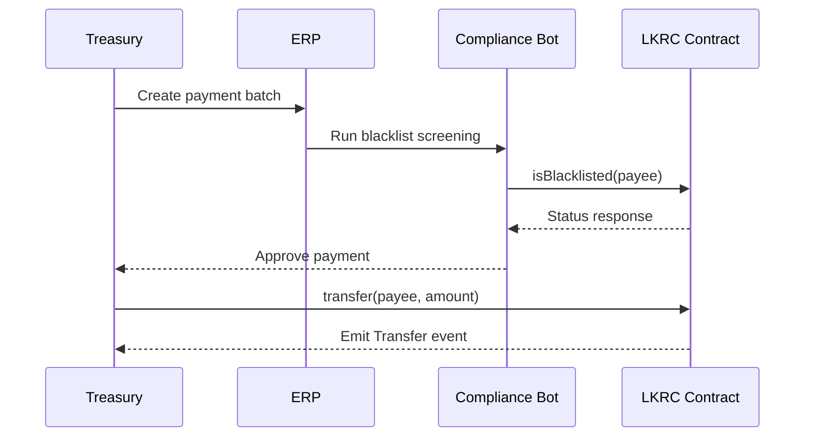
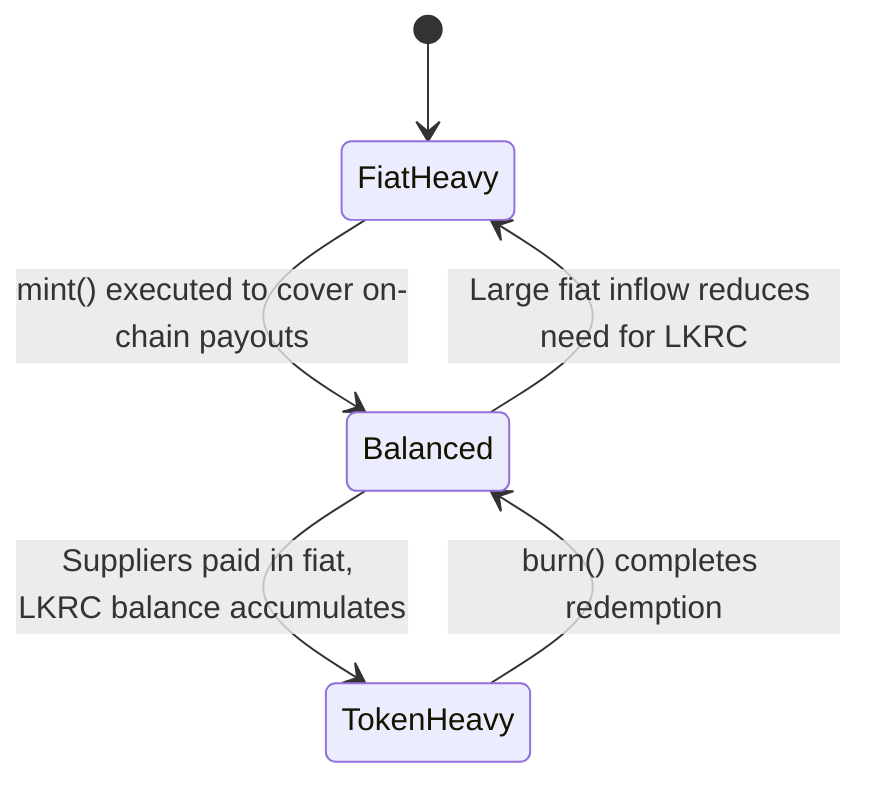
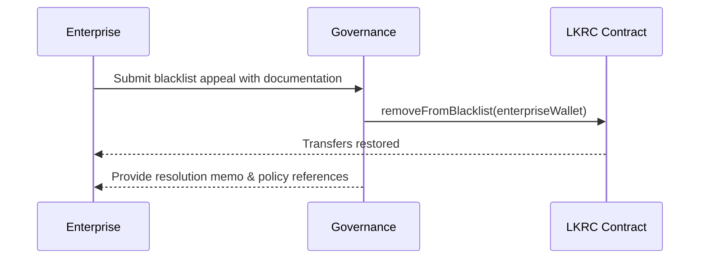

# Enterprise Treasury Runbook

Corporate treasurers hold LKRC for liquidity management, on-chain payments, and hedging. This document outlines how enterprises adopt the stablecoin, manage routine transactions, and respond to exceptional scenarios.

## Onboarding Path

1. **Risk assessment** – Treasury risk committee reviews LKRC governance materials, focusing on access controls such as [`pause`](../../README.md#core-functions) and blacklist authority ([`addToBlacklist`](../../README.md#core-functions)).
2. **Wallet governance** – Security team configures multisig wallets and sets transaction policies aligned with the company’s segregation-of-duties requirements.
3. **Custody integration** – Enterprises connect custodial or self-hosted wallet infrastructure to monitoring tools that watch for events emitted by [`transfer`](../../README.md#core-functions), [`pause`](../../README.md#core-functions), and blacklist updates.
4. **Playbook alignment** – Treasury documents workflows for mint/redemption requests with banking partners, referencing issuer procedures for [`mint`](../../README.md#core-functions) and [`burn`](../../README.md#core-functions).

## Daily Treasury Operations

- **Working capital funding** – Treasury requests LKRC from the bank when expected disbursements exceed fiat limits. Bank coordinates with issuer to call [`mint`](../../README.md#core-functions); enterprise records the transaction hash in its ERP.
- **Supplier payments** – Operations send LKRC to vendors via [`transfer`](../../README.md#core-functions), ensuring automated compliance scripts check [`isBlacklisted`](../../README.md#core-functions) before initiating.
- **Liquidity adjustments** – When reducing exposure, treasury redeems tokens with banking partners that execute [`burn`](../../README.md#core-functions). The enterprise reconciles fiat receipts against on-chain events.

### Treasury Liquidity States

## Edge Cases & Mitigations

- **Paused transfers** – If the issuer activates [`pause`](../../README.md#core-functions), treasury halts on-chain payments and shifts to fiat rails. Governance liaisons monitor issuer announcements for [`unpause`](../../README.md#core-functions) signals before resuming.
- **Blacklist false positive** – Should the enterprise wallet be blacklisted, compliance opens a ticket with issuer governance. After evidence review, governance removes the address using [`removeFromBlacklist`](../../README.md#core-functions) and shares an attestation letter.
- **Counterparty risk event** – If a supplier is blacklisted mid-cycle, treasury uses [`transfer`](../../README.md#core-functions) to reroute payments to an approved wallet. If funds were already sent, legal coordinates with issuer to determine whether [`destroyBlackFunds`](../../README.md#core-functions) was triggered and how to recover value.

**Governance Coordination:** Enterprises should maintain a standing communications channel with issuer governance to receive advance notice of policy updates, scheduled pauses, or changes in blacklist criteria. Align treasury committee minutes with on-chain actions for audit readiness.
