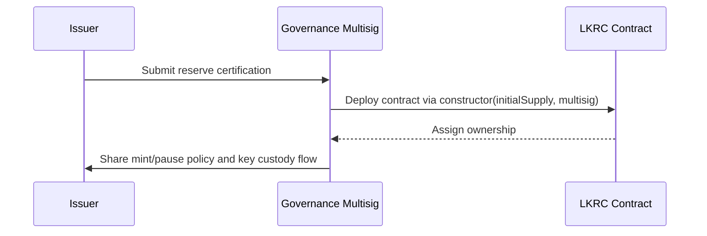
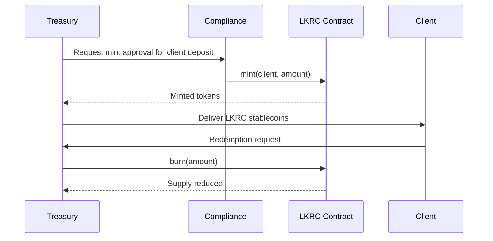
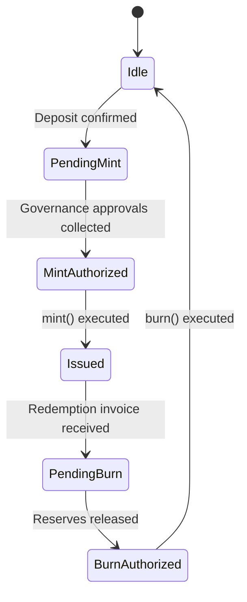
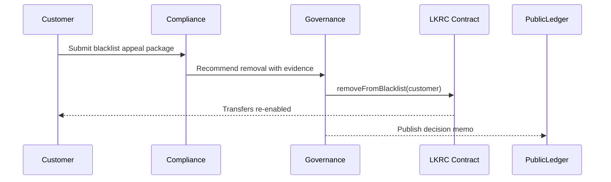

# Stablecoin Issuer Journey

This persona covers the day-to-day experience of the entity that governs reserves, initiates issuance, and enforces compliance controls for the LKRC stablecoin.

## Onboarding

1. **Reserve attestation** – Provide off-chain documentation to the governance council (internal compliance team) to satisfy reserve backing requirements.
2. **Contract ownership assignment** – Deploy the token using the [`constructor`](../../README.md#constructor) with the governance-controlled multisig as `initialOwner`.
3. **Operational policy ratification** – Publish the minting, burning, and pause policies through governance records so that signers understand when to invoke [`mint`](../../README.md#core-functions) and [`pause`](../../README.md#core-functions).
4. **Access handoff** – Store the owner key in a managed custody provider and document the emergency playbook for invoking [`pause`](../../README.md#core-functions) and [`unpause`](../../README.md#core-functions).

## Daily Operations

- **Collateralization cycle** – Treasury monitors reserve inflows and executes controlled issuance using [`mint`](../../README.md#core-functions). Governance signers verify that destination addresses are not on the blacklist before broadcasting.
- **Redemption cycle** – Operations team accepts redemption requests, verifies receipts, and calls [`burn`](../../README.md#core-functions) to keep the supply matched to reserves. Off-chain accounting reconciles redemptions with bank settlements.
- **Incident watch** – Compliance dashboard tracks suspicious addresses and coordinates with legal to add or remove entries using [`addToBlacklist`](../../README.md#core-functions) and [`removeFromBlacklist`](../../README.md#core-functions).

### State of Issuance Pipeline

## Edge Cases & Appeals

- **Emergency halt** – When reserves become uncertain, governance triggers [`pause`](../../README.md#core-functions) to block all transfers. The crisis committee coordinates public communication and resumes operations with [`unpause`](../../README.md#core-functions) once audits confirm solvency.
- **Blacklist appeal** – A customer may appeal their blacklist status. Compliance reviews documentation and, if satisfied, instructs governance to execute [`removeFromBlacklist`](../../README.md#core-functions). Appeals are logged in the governance register for transparency.
- **Destroyed funds reconciliation** – If a regulator orders confiscation, the issuer calls [`destroyBlackFunds`](../../README.md#core-functions) and records the burn in the financial ledger. Governance issues a post-mortem describing the rationale and restitution options.

**Governance Notes:** All emergency actions must be ratified by the governance council within 24 hours. Use the council’s decision log to tie each on-chain transaction hash to meeting minutes for auditability.
